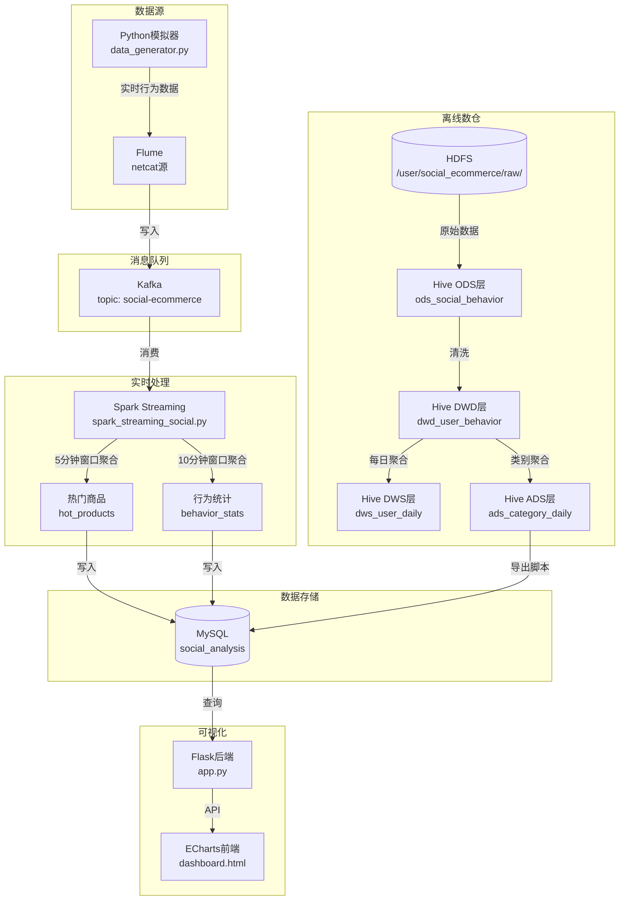

# 社交电商用户行为实时分析平台

## 📌 项目简介
本项目是一个基于 **Hadoop + Flume + Kafka + Spark Streaming + Hive + MySQL + Flask** 构建的社交电商用户行为实时分析平台。实现了从数据采集、实时处理到离线分析的全流程，并提供了可视化看板。

## 🏗️ 系统架构

## 🔧 技术栈
| 组件 | 用途 |
|------|------|
| **Flume** | 实时数据采集（模拟日志 → Kafka） |
| **Kafka** | 消息队列，削峰填谷 |
| **Spark Streaming** | 实时处理，计算热门商品和行为统计 |
| **Hadoop (HDFS)** | 原始数据存储 |
| **Hive** | 离线数仓建设（ODS、DWD、DWS、ADS） |
| **MySQL** | 结果存储（实时聚合 + 离线统计） |
| **Flask + ECharts** | 可视化看板 |
| **Linux** | 运行环境 |

## ✨ 功能模块
### 1. 实时数据采集
- Python 脚本模拟用户行为（点击、收藏、加购、购买）并发送到 Flume。
- Flume 将数据写入 Kafka 主题 `social-ecommerce`。

### 2. 实时处理（Spark Streaming）
- 从 Kafka 消费数据，解析 CSV 格式。
- 统计每 5 分钟热门商品（基于互动得分 `like_num+comment_num+share_num+collect_num`）。
- 统计每 10 分钟各行为类型（互动/购买/浏览）的数量。
- 结果写入 MySQL 表 `hot_products` 和 `behavior_stats`。

### 3. 离线数仓（Hive）
- **ODS 层**：原始数据外部表 `ods_social_behavior`。
- **DWD 层**：清洗后的明细表 `dwd_user_behavior`（按日期分区）。
- **DWS 层**：每日用户行为聚合表 `dws_user_daily`。
- **ADS 层**：按商品类别的每日统计表 `ads_category_daily`。
- 将 ADS 结果通过 Python 脚本导出到 MySQL 表 `category_daily_stats`。

### 4. 可视化看板（Flask + ECharts）
- 展示实时热门商品、行为分布、趋势折线图、热门商品排行榜。
- 支持侧边栏按商品类别筛选。

## 📦 环境要求

### 操作系统
- **Linux**（推荐 CentOS 7.9 或 Ubuntu 20.04），本项目在 CentOS 7.9 上测试通过。

### 软件版本（推荐）
| 组件 | 版本 | 说明 |
|------|------|------|
| **Java** | 1.8 | 必须为 Oracle JDK 或 OpenJDK 8，配置 `JAVA_HOME` 环境变量 |
| **Hadoop** | 3.1.3 | 可选 3.2.x，需配置 HDFS 和 YARN，单机伪分布式即可 |
| **Hive** | 3.1.2 | 需配置 Metastore 为 MySQL，启动 Hive Metastore 服务 |
| **Spark** | 3.4.2 | 需预编译 Hadoop 版本（如 `spark-3.4.2-bin-hadoop3`），启用 Hive 支持 |
| **Kafka** | 3.0.2 | 或更高版本，需内置 ZooKeeper |
| **Flume** | 1.11.0 | 或 1.9.0，配置文件中需包含 Kafka Sink |
| **MySQL** | 8.0.33 | 用于存储 Hive Metastore、实时结果和离线统计结果 |
| **Python** | 3.6+ | 需安装 `flask`, `pymysql`, `pyspark`（可选，用于离线导出） |

### 内存建议
- **最小配置**：4GB 可用内存（可用于启动所有服务，但运行大批量数据时可能不足）。
- **推荐配置**：8GB 以上，可同时运行实时流处理（Spark Streaming）、Kafka、Flume、HDFS 和 YARN。

### 端口要求
确保以下端口未被占用或在防火墙中开放：
- **Hadoop**：9000（RPC），9870（NameNode Web），8088（YARN Web）
- **Kafka**：9092
- **ZooKeeper**：2181
- **Flume**：10050（自定义，可修改）
- **MySQL**：3306
- **Spark**：4040（Spark UI，动态分配）
- **Flask**：5000（可视化看板）

### 环境变量配置示例
在 `/etc/profile` 或 `~/.bashrc` 中添加：
```bash
export JAVA_HOME=/usr/local/jdk1.8
export HADOOP_HOME=/usr/local/hadoop
export HIVE_HOME=/usr/local/hive
export SPARK_HOME=/usr/local/spark
export KAFKA_HOME=/usr/local/kafka
export FLUME_HOME=/usr/local/flume
export PATH=$PATH:$JAVA_HOME/bin:$HADOOP_HOME/bin:$HADOOP_HOME/sbin:$HIVE_HOME/bin:$SPARK_HOME/bin:$KAFKA_HOME/bin:$FLUME_HOME/bin
