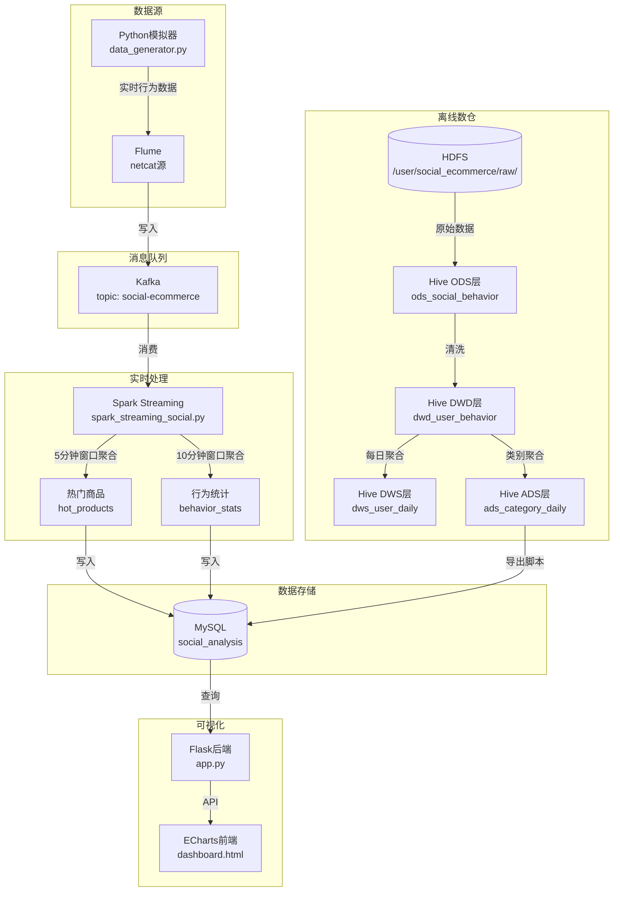

## 🏗️ 系统架构

```mermaid
graph TD
    subgraph 数据源
        A[Python模拟器<br>data_generator.py] -->|实时行为数据| B[Flume<br>netcat源]
    end

    subgraph 消息队列
        B -->|写入| C[Kafka<br>topic: social-ecommerce]
    end

    subgraph 实时处理
        C -->|消费| D[Spark Streaming<br>spark_streaming_social.py]
        D -->|5分钟窗口聚合| E[热门商品<br>hot_products]
        D -->|10分钟窗口聚合| F[行为统计<br>behavior_stats]
    end

    subgraph 数据存储
        E -->|写入| G[(MySQL<br>social_analysis)]
        F -->|写入| G
    end

    subgraph 离线数仓
        H[(HDFS<br>/user/social_ecommerce/raw/)] -->|原始数据| I[Hive ODS层<br>ods_social_behavior]
        I -->|清洗| J[Hive DWD层<br>dwd_user_behavior]
        J -->|每日聚合| K[Hive DWS层<br>dws_user_daily]
        J -->|类别聚合| L[Hive ADS层<br>ads_category_daily]
        L -->|导出脚本| G
    end

    subgraph 可视化
        G -->|查询| M[Flask后端<br>app.py]
        M -->|API| N[ECharts前端<br>dashboard.html]
    end
```
